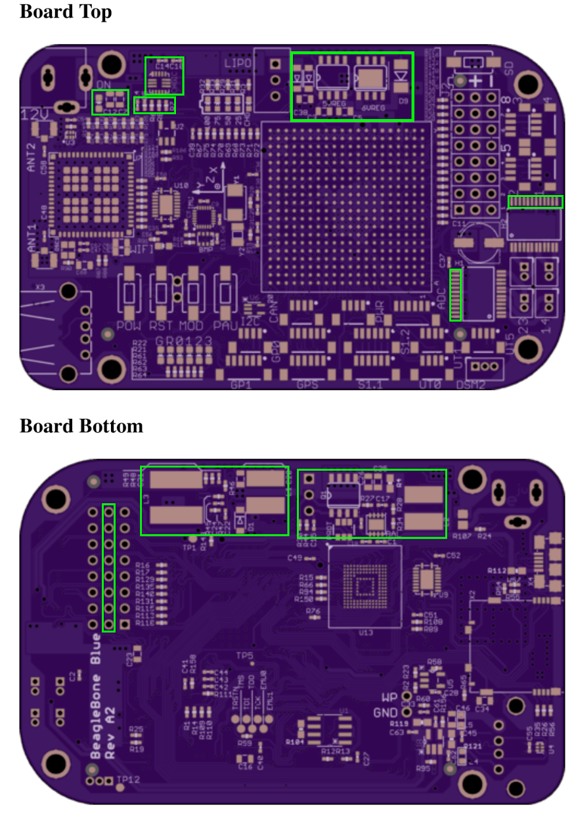

# PCB fabrication information
* 1.6 mm PCB thickness
* 1 oz copper thickness on outer layers
* 0.5 oz copper on internal layers
* Solder mask as blue
* Silk print as white

# Files
* bb_blue_4layer.cam - EAGLE CAM script
* BeagleBone_Blue.dri - drill log
* BeagleBone_Blue.gpi - outline log
* BeagleBone_Blue.toplayer.ger - top layer copper
* BeagleBone_Blue.internalplane1.ger - inner layer copper
* BeagleBone_Blue.ingernalplane2.ger - inner layer copper
* BeagleBone_Blue.bottomlayer.ger - bottom layer copper
* BeagleBone_Blue.topsilkscreen.ger - top layer silkscren
* BeagleBone_Blue.bottomsilkscreen.ger - bottom layer silkscren
* BeagleBone_Blue.boardoutline.ger - board outline or mill layer
* BeagleBone_Blue.tcream.ger - top layer solder paste
* BeagleBone_Blue.bcream.ger - bottom layer solder paste
* BeagleBone_Blue.topsoldermask.ger - top layer soldermask
* BeagleBone_Blue.bottomsoldermask.ger - bottom layer soldermask
* BeagleBone_Blue.drills.xln - drill file

# Conformal coating application areas

